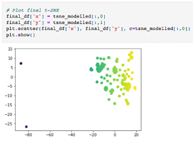

# Cryptocurrency Clustering analysis - Unsupervised Learning

## Background

Used raw data obtained from [CryptoCompare](https://min-api.cryptocompare.com/data/all/coinlist), to analyse cryptocurries to determine whether similar cryptocurrenicies can be grouped using several clustering algorithms. 
Unsupervised learning was used, since there is no known classification system.  
Finally, Data visualisation is utilised to share findings with potential ivestors lookng to expand their cryptocurrency portfolio. 

### Data Preparation

* The  `crypto_data.csv` located in the [/Resources](Resources/) directory was read into Pandas. 
* All cryptocurrencies not being traded were dropped from the dataset.
* The `CoinName` column was dropped from the original dataframe, as it doesn't contribute to the analysis and all data needs to be numeric to be comprehensible to the machine learning algorithm.
 `Algorithm` and `ProofType`, were converted into numerical data. 
* The final data was standardised so that columns that contain larger values do not unduly influence the outcome.

### PCA Dimensionality Reduction
* Used PCA to identify the principal components while preserving 90% of the explained variance, using `PCA(n_components=0.90)` 

### t-SNE Analysis
* Applied t-SNE to PCA output and created a scatter plot to visualise results of the t-SNE output, to determine if any distinct clusters are present.

### Cluster Analysis with k-Means

* Created an elbow plot to identify the best number of clusters. 

## References

Crypto Coin Comparison Ltd. (2020) Coin market capitalization lists of crypto currencies and prices. Retrieved from [https://www.cryptocompare.com/coins/list/all/USD/1](https://www.cryptocompare.com/coins/list/all/USD/1)

